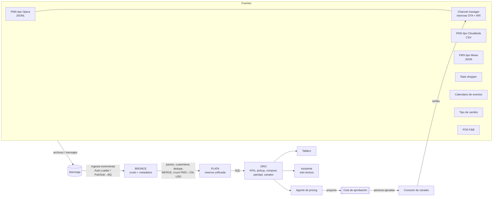

# Arquitectura del producto de datos

## Flujo

## Qué resuelve cada capa (y qué prueba el simulador)

| Capa | Problema real del hotel | Cómo lo reproduce el simulador | Dónde |
|---|---|---|---|
| Aterrizaje | Cada sistema exporta a su manera, a su ritmo | 4 formatos, 3 monedas, fechas `dd/mm/yyyy`, coma decimal, UTC vs hora local | `sources.py` |
| Bronce | Perder datos al "limpiar" | Guarda todo crudo; lo malformado se marca `parse_ok=False`, no se descarta | `ingest.py` |
| Plata | La misma reserva en PMS y en el channel manager, con claves distintas | Cruce por referencia de OTA normalizada (≈92 % de las OTAs la traen en el PMS) y, si falta, por coincidencia de hotel+habitación+fechas+canal+huésped+importe USD ±5 % | `silver.build_reservations` |
| Plata | Duplicados, líneas rotas, importes negativos | Reenvíos, ~0,3 % de líneas truncadas, 0,1 % de importes negativos → dedupe y cuarentena | `silver.load_events` |
| Plata | Monedas locales con inflación | ARS/COP/MXN → USD con el FX del día de la reserva | `silver.to_usd` |
| Oro | "¿Cómo estamos vs. el año pasado?" sin armar Excel | Pickup/pace/STLY reconstruidos con `created_at`/`cancelled_at` | `sql/060_pickup.sql` |
| Oro | Fugas de paridad con OTAs | Booking publica −6 % vs. directo ~6 % de los días; el tablero las detecta | `sql/080_parity.sql` |
| Frescura | "¿Puedo confiar en este número ahora?" | Retraso por fuente visible en tablero y asistente | `gold_source_health` |

Reconciliación contra la verdad del simulador (test `test_pipeline.py`): reservas unificadas ≈ reservas reales
(diferencia = lo que fue a cuarentena, <3 %), ingreso dentro de 2 %, 0 reservas sin tipo de cambio.

## Casi tiempo real

`hotelsim tick` avanza el reloj simulado, escribe archivos nuevos (reservas y ARI) y reprocesa solo los archivos
nuevos hacia bronce (checkpoint, igual que Auto Loader). **Plata y oro se recalculan completos** en cada tick
(~5 s con ~30 mil reservas): es una simplificación local, no el diseño objetivo. En la nube el camino incremental
es `apply_changes` (Databricks) o `MERGE` con ventana (BigQuery): ver `cloud/`.

La latencia de extremo a extremo de un producto real la fijan las fuentes, no la plataforma: Booking limita las
llamadas por minuto, y los PMS/channel managers empujan por webhook o se consultan por *polling*. Por eso el
simulador modela la demora PMS↔channel manager en vez de asumir datos instantáneos.

## Databricks vs. GCP para este producto

Mapeo funcional (no es un benchmark de costo ni de rendimiento: eso hay que medirlo con datos del cliente):

| Necesidad | Databricks | GCP |
|---|---|---|
| Aterrizaje | Volume de Unity Catalog / object storage | Cloud Storage y/o Pub/Sub |
| Ingesta incremental de archivos | Auto Loader (`cloudFiles`) | Pub/Sub → BigQuery subscription; Dataflow si se necesita *exactly-once* o transformación |
| Bronce / plata | Tablas Delta en pipelines declarativos; `apply_changes` para estado actual; expectativas para cuarentena | Tablas BigQuery; `MERGE` programado (consultas programadas o Dataform) |
| Oro / BI | Vistas materializadas + Databricks SQL / AI/BI | Tablas/vistas BigQuery + Looker Studio / Looker |
| Agente y chat | App/Job + API de Claude; consultas por SQL warehouse | Cloud Run + API de Claude (o Claude en Vertex AI); consultas en BigQuery |
| Garantía de entrega | Checkpoint de Auto Loader (*exactly-once* al escribir en Delta) | BigQuery subscription: *al menos una vez* → dedupe en plata |

Criterio práctico para el MVP: si el cliente ya tiene su ecosistema en una nube, usar esa. Sin preferencia, GCP
es más corto para un primer tablero (Pub/Sub → BigQuery → Looker Studio casi sin infraestructura propia); Databricks
pesa más cuando hay mucho dato no estructurado, ML propio o varios equipos compartiendo el lakehouse. Es una
opinión de diseño, no un hallazgo verificado.

### Portabilidad del SQL de oro

Se escribió en SQL casi estándar y se corre en DuckDB. Al migrar hay que traducir funciones de fecha
(`fecha − 7`, `INTERVAL 7 DAY`, `date_trunc`, `MEDIAN`) y el operador `::`: hay ejemplos en
`cloud/databricks/02_gold.sql` y `cloud/gcp/sql/gold_daily_kpis.sql`. **Traduje solo un ejemplo por nube**; el resto
de las tablas de oro quedan por portar y validar contra los mismos tests de reconciliación.

## Decisiones y límites conocidos

- **Reglas, no ML, para el pricing.** Cada recomendación se explica en una línea; con un hotel real y 2–3 años de
  historia se evalúa un modelo de demanda, comparándolo contra estas reglas en el mismo backtest.
- **Pricing solo a nivel BAR directa, por tipo de habitación.** No cubre restricciones (mínimo de noches, cierres), planes de tarifa ni paquetes.
- **Un solo compset y solo tipo Standard** (se escala por tipo de habitación).
- **El backtest no prueba mejoras de ingreso**: valida que la señal ordene las fechas por ocupación final y estima ingreso contrafactual bajo una elasticidad supuesta (ver `docs/AGENTE.md`).
- **Sin autenticación ni multiusuario**: `hotelsim serve` escucha en 127.0.0.1. No lo expongas a internet tal cual.
- **Privacidad**: el simulador guarda nombres sintéticos de huéspedes. Con datos reales hay que definir seudonimización y retención antes de llevar el PII al lago.
